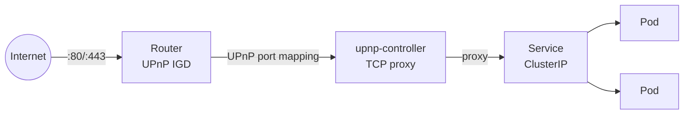
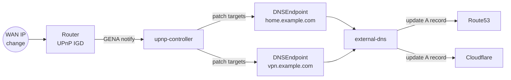

# upnp-controller

A Kubernetes controller that automatically exposes cluster services to the internet through your home router's UPnP port mapping. Annotate a Service, and the controller programs your router — no manual port forwarding needed. Lightweight: ~3 MiB RAM, single binary.



With external-dns for dynamic DNS:



## How it works

The controller runs with `hostNetwork: true` on a cluster node that has LAN access to your router. It discovers the router via SSDP multicast, then:

1. **Annotation-driven**: annotate any Service with `upnp-controller.io/port-forward: "80,443"` and the controller starts a local TCP proxy, programs the router via UPnP, and traffic flows from the internet to your pods
2. **CRD-driven**: create `PortMapping` CRDs directly for non-Kubernetes hosts (NAS, game server, etc.)
3. **Self-healing**: mappings are automatically renewed before lease expiry, and the controller re-programs the router on restart

The controller proxies through itself so that the UPnP request source IP matches the mapping target — this satisfies routers that restrict UPnP mappings to the requesting device.

## Quick start

### Install with Helm

```bash
helm install upnp-controller oci://ghcr.io/jeffmoss/upnp-controller/chart \
  -n upnp-controller --create-namespace
```

Or from source:

```bash
helm install upnp-controller chart/upnp-controller \
  -n upnp-controller --create-namespace
```

### Expose a Service

Annotate any Service to forward ports through the router:

```yaml
apiVersion: v1
kind: Service
metadata:
  name: traefik
  annotations:
    upnp-controller.io/port-forward: "80,443"
spec:
  type: ClusterIP
  # ...
```

The controller creates PortMapping CRDs automatically:

```
$ kubectl get portmappings -A
NAMESPACE     NAME                          EXTERNAL PORT   INTERNAL HOST   PROTOCOL   ACTIVE   EXTERNAL IP
kube-system   kube-system-traefik-80-tcp    80              192.168.0.123   TCP        true     75.169.255.229
kube-system   kube-system-traefik-443-tcp   443             192.168.0.123   TCP        true     75.169.255.229
```

### Annotation format

```yaml
# Map all service ports (external = service port)
upnp-controller.io/port-forward: "true"

# Map specific ports only
upnp-controller.io/port-forward: "443,80"

# Remap: externalPort:servicePort
upnp-controller.io/port-forward: "8080:80,8443:443"
```

### Manual PortMapping (non-Kubernetes hosts)

```yaml
apiVersion: upnp-controller.io/v1alpha1
kind: PortMapping
metadata:
  name: minecraft
spec:
  externalPort: 25565
  internalHost: "192.168.0.50"
  internalPort: 25565
  protocol: TCP
  description: "Minecraft server"
```

### Dynamic DNS with external-dns

The controller can keep `DNSEndpoint` resources (from [external-dns](https://github.com/kubernetes-sigs/external-dns)) updated with your WAN IP. Annotate any `DNSEndpoint` with `upnp-controller.io/managed: "true"` and the controller will set the `targets` of all A records to the current public IP from GatewayStatus.

```yaml
apiVersion: externaldns.k8s.io/v1alpha1
kind: DNSEndpoint
metadata:
  name: home
  annotations:
    upnp-controller.io/managed: "true"
spec:
  endpoints:
  - dnsName: home.example.com
    recordType: A
    recordTTL: 60
    targets: []  # controller fills this with the WAN IP
```

When your WAN IP changes, the controller updates the targets automatically. External-dns then propagates the change to your DNS provider (Route53, Cloudflare, etc.).

The DNSEndpoint CRD must be installed (comes with external-dns). If it's not present, the controller logs a message and skips this feature.

## Configuration

All configuration is via Helm values or environment variables:

| Helm value | Env var | Default | Description |
|------------|---------|---------|-------------|
| `logLevel` | `LOG_LEVEL` | `warn` | Log level (`info`, `debug`, etc.) |
| `gatewayUrl` | `GATEWAY_URL` | (auto-discovered) | Router rootDesc.xml URL. If unset, SSDP discovers it automatically |
| `gena.enabled` | `GENA_ENABLED` | `true` | Subscribe to UPnP GENA events for instant WAN IP change detection |
| `polling.interval` | `POLL_INTERVAL_SECS` | `600` | Backup polling interval when GENA is active |
| `polling.fastInterval` | `POLL_INTERVAL_FAST_SECS` | `10` | Polling interval when GENA is unavailable |

## GatewayStatus

A cluster-scoped singleton `GatewayStatus/default` is created automatically, tracking your router's state:

```
$ kubectl get gatewaystatus
NAME      EXTERNAL IP      READY   LAST SEEN
default   75.169.255.229   true    2026-03-16T08:21:56Z
```

Fields: `externalIP`, `gatewayURL`, `lanIP`, `subscriptionID`, `lastSeen`, `ready`.

## CRD reference

See [docs/crds.md](docs/crds.md) for full field descriptions and examples.

## Architecture

See [docs/architecture.md](docs/architecture.md) for component diagrams, startup sequence, and data flows.

## Development

### Prerequisites

- Rust (stable)
- Docker
- KVM/libvirt (for e2e tests)
- A UPnP-enabled router on the LAN

### Build and test

```bash
cargo build          # build
cargo test           # unit tests
cargo clippy         # lint
```

### k3s test cluster

The `k3s/` directory contains scripts to create a 3-node k3s cluster on your LAN using KVM + macvtap. Each node gets a real LAN IP from your router's DHCP.

```bash
just cluster-up      # create 3-node k3s cluster
just build-image     # build and import image to all nodes
just deploy          # install via kustomize
just e2e             # run e2e tests
just cluster-down    # tear down
just e2e-full        # one-command: cluster-up → build → deploy → test
```

The cluster uses two networks per VM:
- **enp1s0** (macvtap): LAN-routable IP via DHCP — used by Kubernetes
- **enp2s0** (host-only): management network for SSH from the host

### E2E tests

E2E tests run against the real k3s cluster and real router. They verify SSDP discovery, LAN IP detection, controller deployment, and the full PortMapping lifecycle including UPnP programming.

```bash
# With a running cluster:
KUBECONFIG=k3s/kubeconfig cargo test --features e2e

# Or the full cycle:
just e2e-full
```

### Container image

```bash
docker build -t upnp-controller:latest .
```

### Releases

Tagged releases are built automatically via GitHub Actions and pushed to `ghcr.io/jeffmoss/upnp-controller`. CI runs `cargo test` and `cargo clippy` on every push.

```bash
git tag v0.2.0
git push origin v0.2.0
```
