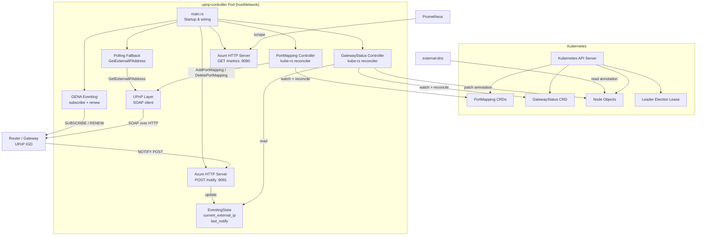
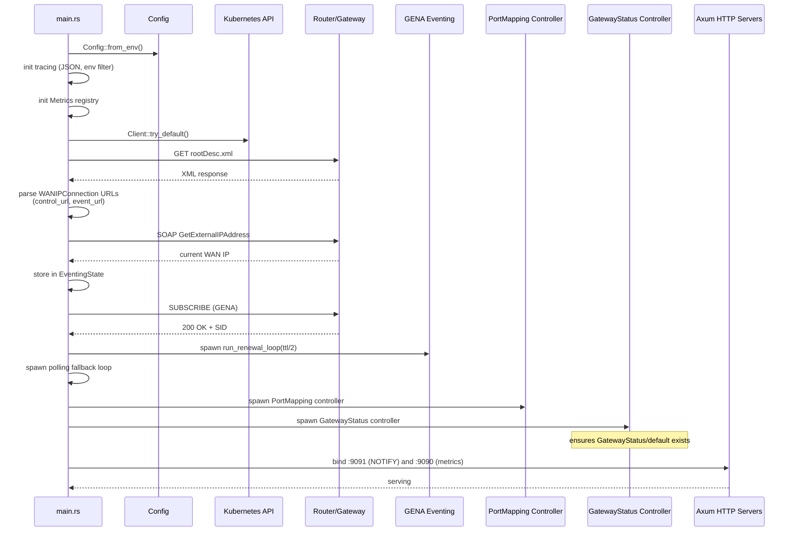
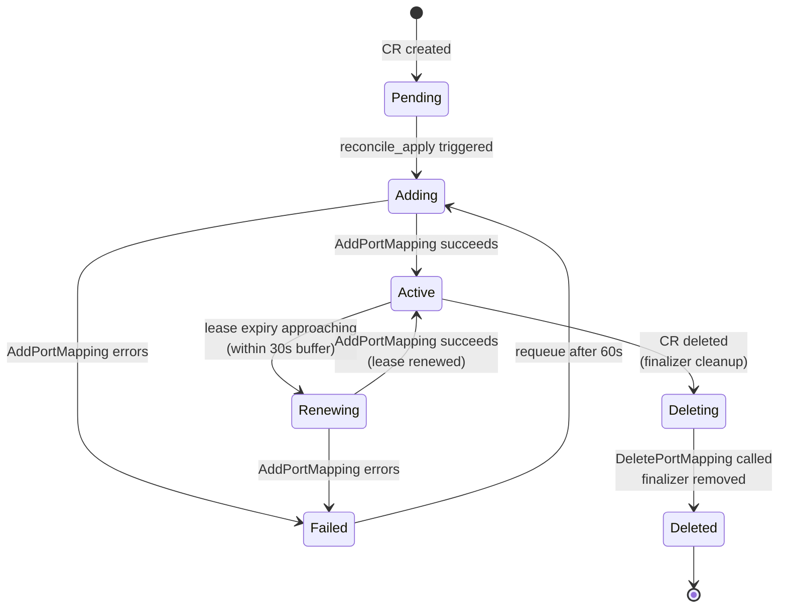
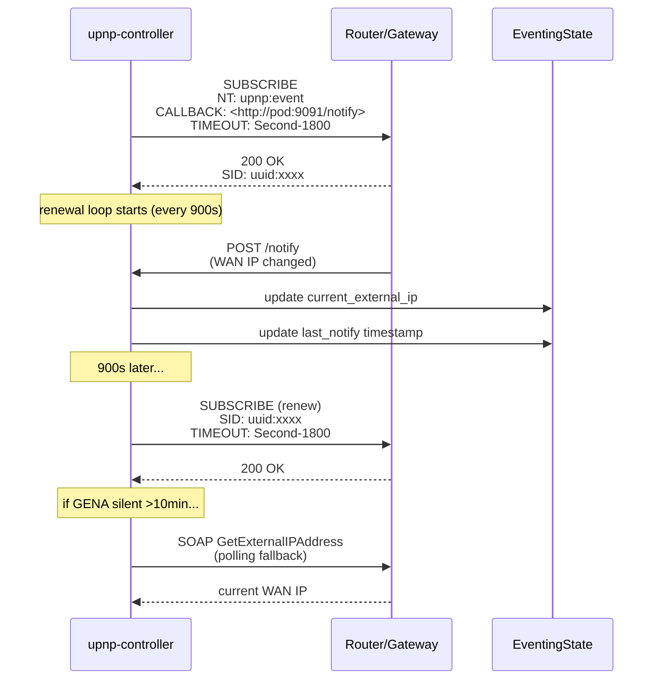
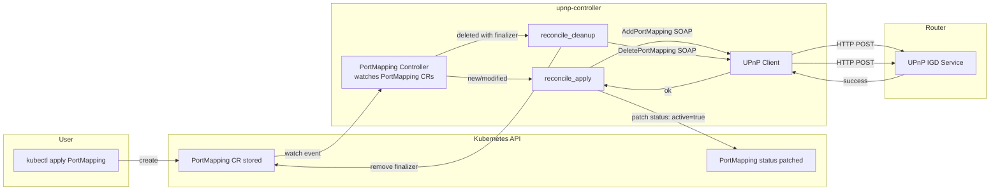
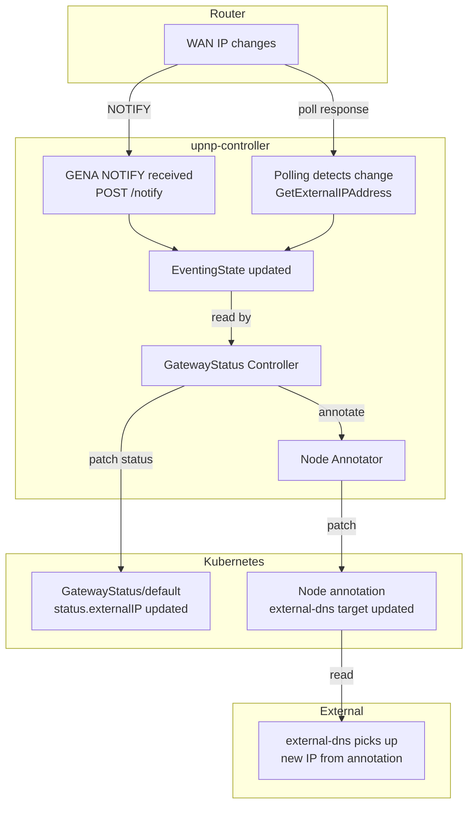

# Architecture

This document describes the internal architecture of the upnp-controller, including component interactions, startup sequence, reconciliation state machines, and data flows.

## Overall architecture

### Component summary

| Component | Source | Responsibility |
|-----------|--------|----------------|
| **main.rs** | `src/main.rs` | Wires everything together: config, discovery, GENA subscribe, spawn controllers and HTTP servers |
| **PortMapping Controller** | `src/controllers/port_mapping_ctrl.rs` | Watches `PortMapping` CRs, calls `AddPortMapping`/`DeletePortMapping` SOAP actions, manages finalizer and lease renewal |
| **GatewayStatus Controller** | `src/controllers/gateway_ctrl.rs` | Ensures the `GatewayStatus/default` singleton exists, patches its status with current WAN IP and subscription info, annotates nodes |
| **UPnP Client** | `src/upnp/port_mapping.rs` | SOAP client for `AddPortMapping`, `DeletePortMapping`, `GetExternalIPAddress`, and `GetGenericPortMappingEntry` |
| **Discovery** | `src/upnp/discovery.rs` | Fetches and parses `rootDesc.xml` to find WANIPConnection/WANPPPConnection control and event URLs |
| **GENA Eventing** | `src/upnp/eventing.rs` | Subscribes to UPnP GENA events, handles subscription renewal loop, parses NOTIFY bodies |
| **Polling Fallback** | `src/main.rs` (inline task) | Calls `GetExternalIPAddress` every `POLL_INTERVAL_SECS` when GENA is silent or unavailable |
| **Axum NOTIFY server** | `src/main.rs` | Receives `POST /notify` callbacks from the router, updates `EventingState` |
| **Axum Metrics server** | `src/main.rs` | Serves Prometheus metrics on `GET /metrics` |
| **EventingState** | `src/upnp/eventing.rs` | Thread-safe shared state holding `current_external_ip`, `last_notify`, and subscription info |
| **Config** | `src/config.rs` | Reads all configuration from environment variables |
| **Metrics** | `src/metrics.rs` | Prometheus registry with all upnp_* metrics |
| **Node Annotation** | `src/node.rs` | Patches `external-dns.alpha.kubernetes.io/target` on the node for external-dns integration |

## Startup sequence

## PortMapping reconcile loop

The PortMapping controller uses a kube-rs finalizer to manage the full lifecycle. The state machine below shows the logical states and transitions:

### Key implementation details

- **Finalizer**: `upnp.k8s.io/cleanup` -- added on first reconcile, removed after cleanup
- **Lease duration**: default 3600 seconds (1 hour), requested via `NewLeaseDuration` SOAP parameter
- **Renewal buffer**: 30 seconds before expiry, the controller requeues to renew
- **Failure requeue**: 60 seconds on `AddPortMapping` failure
- **Error policy**: 30 second requeue on unhandled controller errors
- **Status conditions**: `Active` condition with `True`/`False` status and reason codes `MappingEstablished` or `AddFailed`

## GENA subscription lifecycle

### Fallback behavior

The polling loop runs independently and checks whether GENA has been silent:

1. If `last_notify` is `None` (never received a NOTIFY) or older than 10 minutes, polling activates
2. If GENA subscription failed entirely at startup, polling is always active
3. Poll interval is configurable via `POLL_INTERVAL_SECS` (default: 300 seconds)

### Renewal

- GENA subscriptions are requested with a 1800 second (30 minute) TTL
- The renewal loop fires at half the TTL (every 900 seconds)
- On renewal failure, the subscription is cleared and the controller falls back to polling

## Data flow: PortMapping CR lifecycle

This diagram shows how a `PortMapping` CR flows through the system from creation to deletion:

### Step-by-step flow

1. User creates a `PortMapping` CR via `kubectl apply`
2. The Kubernetes API stores the resource and fires a watch event
3. The PortMapping controller receives the event and runs `reconcile_apply`
4. The controller adds the `upnp.k8s.io/cleanup` finalizer if not present
5. The UPnP client sends an `AddPortMapping` SOAP request to the router
6. On success, the controller patches the CR status with `active: true`, the external IP, lease expiry, and an `Active` condition
7. The controller requeues itself for ~30 seconds before lease expiry to renew
8. On renewal, step 5-7 repeat
9. When the user deletes the CR, the finalizer triggers `reconcile_cleanup`
10. The UPnP client sends a `DeletePortMapping` SOAP request to the router
11. The finalizer is removed, allowing Kubernetes to garbage collect the CR

## Data flow: WAN IP change propagation

When the router's WAN IP changes:

1. The router sends a GENA NOTIFY to `POST /notify` (or the polling loop detects the change)
2. `EventingState.current_external_ip` is updated; `wan_ip_changes` metric is incremented
3. On its next reconcile (every 60 seconds), the GatewayStatus controller reads the new IP from `EventingState`
4. It patches `GatewayStatus/default` with the new `externalIP` and `lastSeen`
5. If `ANNOTATE_NODES=true`, it patches the node's `external-dns.alpha.kubernetes.io/target` annotation
6. external-dns reads the annotation and updates DNS records accordingly
