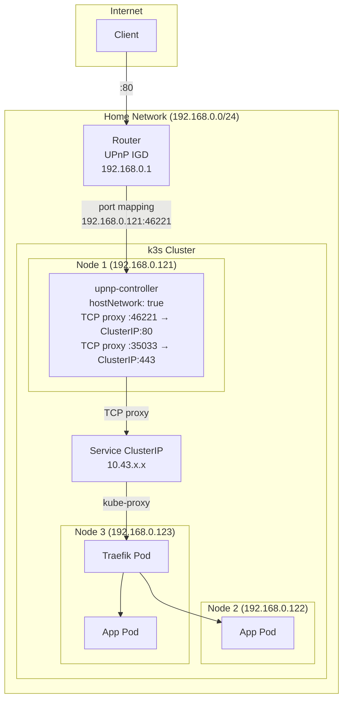
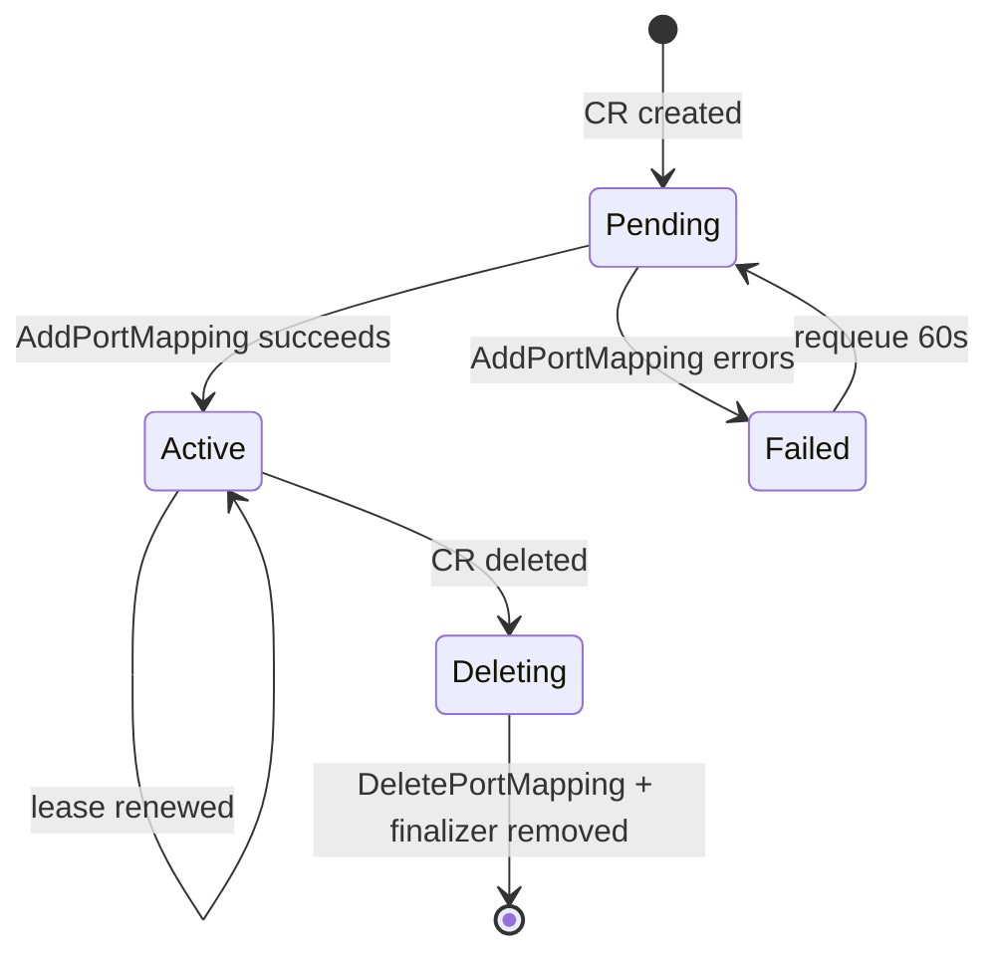

# Architecture

## Network layout

## Components

| Component | Source | Purpose |
|-----------|--------|---------|
| **main.rs** | `src/main.rs` | Startup: SSDP discovery, GENA subscribe, spawn controllers |
| **PortMapping Controller** | `src/controllers/port_mapping_ctrl.rs` | Reconciles PortMapping CRDs → UPnP AddPortMapping/DeletePortMapping |
| **Service Watcher** | `src/controllers/port_mapping_ctrl.rs` | Watches annotated Services → starts TCP proxy → creates PortMapping CRDs |
| **Pod Watcher** | `src/controllers/port_mapping_ctrl.rs` | Watches annotated Pods → starts TCP proxy → creates PortMapping CRDs |
| **TCP Proxy** | `src/proxy.rs` | Per-port TCP proxy that forwards connections to ClusterIP targets |
| **GatewayStatus Controller** | `src/controllers/gateway_ctrl.rs` | Maintains GatewayStatus singleton with WAN IP and router info |
| **UPnP Client** | `src/upnp/port_mapping.rs` | SOAP client for UPnP IGD |
| **SSDP Discovery** | `src/upnp/discovery.rs` | Discovers router via multicast, parses rootDesc.xml |
| **GENA Eventing** | `src/upnp/eventing.rs` | Subscribes to WAN IP change notifications |
| **Config** | `src/config.rs` | Environment variable config, LAN IP detection |
| **Proxy Manager** | `src/proxy.rs` | Manages lifecycle of TCP proxy instances |

## How annotation port-forwarding works

1. User annotates a Service: `upnp-controller.io/port-forward: "80,443"`
2. Service watcher detects the annotation, reads the Service's ClusterIP
3. For each port, the proxy manager starts a TCP listener on an ephemeral port
4. A PortMapping CRD is created: external port → controller's LAN IP : proxy port
5. The PortMapping controller reconciles it → sends UPnP AddPortMapping to the router
6. The router accepts because the UPnP request source IP matches the mapping target
7. Traffic: Internet → Router:80 → Controller:46221 → (proxy) → ClusterIP:80 → Pod

## Why the proxy is needed

UPnP routers typically only accept AddPortMapping requests where the internal client IP matches the IP of the device making the request. Without the proxy, the controller would need to map to a different IP (MetalLB VIP, pod IP, etc.), which most routers reject with error 718 (ConflictInMappingEntry).

The proxy ensures the controller maps to its own LAN IP, then forwards traffic internally to wherever it needs to go via the cluster's normal networking (kube-proxy / ClusterIP).

## PortMapping reconcile state machine

## GENA subscription

The controller subscribes to UPnP GENA events for instant WAN IP change detection. A polling fallback runs at a slower interval as backup. If GENA is unavailable, polling runs at 10s intervals.
